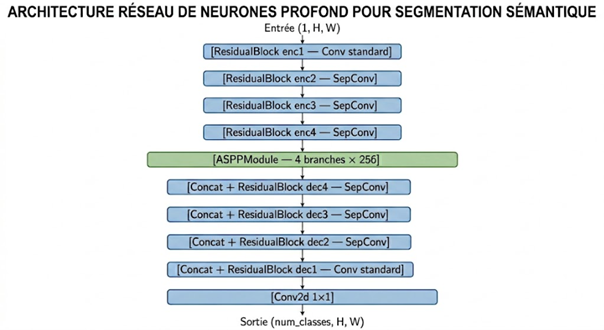
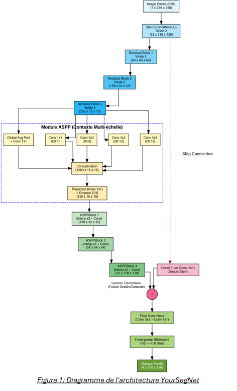

# YourUNet-YourSegNet-ACDC

Advanced cardiac MRI segmentation using state-of-the-art deep learning architectures. This project implements multiple UNet-based models for segmenting cardiac structures (right ventricle, myocardium, left ventricle) from 2D cardiac cine-MRI images using the ACDC dataset.

##  Table of Contents
- [Features](#features)
- [Installation](#installation)
- [Architecture](#architecture)
- [Usage](#usage)
- [Training](#training)
- [Results](#results)
- [Data Augmentation](#data-augmentation)
- [Checkpointing](#checkpointing)

## Features

###  Implemented Architectures
- **UNet**: Classic encoder-decoder architecture for medical image segmentation
- **YourUNet**: Enhanced UNet with:
  - Residual blocks (ResNet-style skip connections)
  - Depthwise separable convolutions for efficiency
  - ASPP (Atrous Spatial Pyramid Pooling) module at bottleneck for multi-scale context
  
- **YourSegNet**: Non-symmetric encoder-decoder with:
  - Aggressive downsampling encoder (1/2 → 1/4 → 1/8 → 1/16)
  - Lightweight decoder with dilated convolutions
  - Multi-scale context aggregation via ASPP
  - Detail fusion for enhanced segmentation

###  Advanced Training Features
- **Checkpointing**: Automatic saving of best model during training based on validation accuracy
- **Custom Loss Functions**:
  - Dice Loss: Specifically designed for medical image segmentation
  - Combined Loss: Weighted combination of Cross-Entropy and Dice Loss
  - Cross-Entropy Loss: Baseline loss function
- **Data Augmentation**:
  - Random horizontal flips
  - Random rotations (±15°)
  - RandomAffine transformations
- **Learning Rate Scheduling**: ReduceLROnPlateau scheduler for adaptive learning rate
- **Model Zoo**: Includes additional architectures (ResNet, AlexNet, VGG) for classification tasks

##  Installation

### Prerequisites
- Python 3.7+
- CUDA 11.0+ (for GPU acceleration)
- PyTorch 1.9+

### Setup
Install dependencies in a Python virtual environment:

```bash
pip install -r requirements.txt
```

Download the ACDC dataset (HDF5 format) and place it in the `data/` directory:
```
data/ift780_acdc.hdf5
```

## Architecture

### Model Architectures

#### YourUNet


#### YourSegNet  



## Usage

View all available options:
```bash
python src/train.py --help
```

### Training Models

**Train UNet (baseline):**
```bash
python src/train.py --model UNet --num-epochs 40 --batch_size 20 --lr 0.001
```

**Train YourUNet with data augmentation:**
```bash
python src/train.py --model yourUNet --num-epochs 40 --batch_size 20 --lr 0.001 --data_aug
```

**Train YourSegNet with Dice Loss:**
```bash
python src/train.py --model yourSegNet --num-epochs 40 --batch_size 20 --lr 0.001 --loss dice --data_aug
```

**Train with combined loss function:**
```bash
python src/train.py --model yourUNet --num-epochs 40 --batch_size 20 --lr 0.001 --loss combined
```

### Available Options
```
--model {CnnVanilla, VggNet, AlexNet, ResNet, yourUNet, yourSegNet, UNet}
--dataset {cifar10, svhn, acdc}
--loss {CE, Dice, Combined}
--batch_size (int, default=20)
--optimizer {Adam, SGD}
--num-epochs (int, default=10)
--validation (float, default=0.1)
--lr (float, default=0.001)
--data_aug (flag to enable data augmentation)
```

## Training

### Learning Curves
Training logs are saved during training. Plot learning curves using the integrated visualization:
```bash
python src/train.py --model yourUNet --num-epochs 40 --data_aug
```

The trainer will automatically:
1. Display real-time training/validation metrics
2. Save the best model checkpoint
3. Generate learning curves at the end of training

### Example Results
- **UNet**: ~79% validation accuracy
- **YourUNet**: >80% validation accuracy (with residual blocks + ASPP)
- **YourSegNet**: >75% validation accuracy (non-symmetric design)

## Data Augmentation

Data augmentation is applied to improve model generalization:

```bash
python src/train.py --model yourUNet --data_aug
```

Applied augmentations:
- **Random Horizontal Flip** (p=0.5): Flip images left-right
- **Random Rotation** (±15°): Rotation augmentation
- **Random Affine** (10°): Affine transformations
- **Color Jitter**: Brightness, contrast, saturation adjustments (for classification tasks)

### Augmentation Examples
See `fig_augmentation_examples.png` for visual examples of applied augmentations.

## Checkpointing

The training manager automatically saves the best model based on validation accuracy:

```
best_<model_name>.pt
```

Example checkpoints:
```
best_yourUNet.pt
best_yourSegNet.pt
best_UNet.pt
```

Best model is saved when validation accuracy improves.

## Project Structure

```
YourUNet-YourSegNet-ACDC/
├── src/
│   ├── train.py                 # Main training script
│   ├── losses.py                # Custom loss functions
│   ├── train.ipynb              # Jupyter notebook for experimentation
│   ├── manage/
│   │   ├── CNNTrainTestManager.py  # Training & testing manager
│   │   ├── DataManager.py          # Data loading utilities
│   │   └── HDF5Dataset.py          # HDF5 dataset handler
│   ├── models/
│   │   ├── UNet.py              # Standard UNet
│   │   ├── yourUNet.py          # Enhanced UNet with residuals + ASPP
│   │   ├── yourSegNet.py        # Non-symmetric architecture
│   │   ├── CNNBaseModel.py      # Base model class
│   │   ├── CNNBlocks.py         # Reusable blocks
│   │   ├── ResNet.py            # ResNet classifier
│   │   ├── AlexNet.py           # AlexNet classifier
│   │   └── VggNet.py            # VGG classifier
│   └── utils/
│       └── utils.py             # Utility functions
├── data/
│   └── ift780_acdc.hdf5         # ACDC dataset (download required)
├── requirements.txt             # Python dependencies
├── README.md                    # This file
└── LICENSE                      # MIT License
```

## Requirements

See `requirements.txt` for complete list. Key dependencies:
- torch & torchvision
- h5py (HDF5 dataset handling)
- numpy, scipy, scikit-image
- matplotlib (visualization)
- tqdm (progress bars)

## References

- ACDC Dataset: https://www.creatis.insa-lyon.fr/Challenge/acdc/
- Original UNet: https://arxiv.org/abs/1505.04597
- DeepLabV3: https://arxiv.org/abs/1706.05587
- ASPP: https://arxiv.org/abs/1706.05587

## License

This project is licensed under the MIT License - see the LICENSE file for details.

## Authors

- Fokoue Thomas, Mamadou Mountagha BAH & Pierre-Marc Jodoin (Original framework)
- Modified and extended for advanced cardiac segmentation
